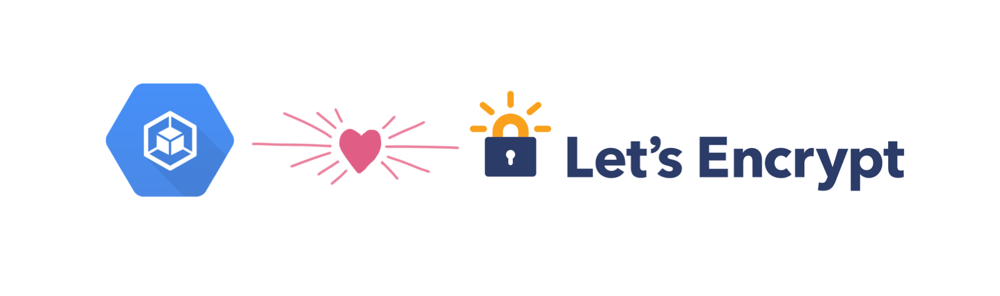

# Let’s Encrypt on GKE

[GKE] (Google Kubernetes Engine) does not offer an out-of-the-box HTTPS solution
or TLS/SSL certificates for your websites today:

- **[Let’s Encrypt][le]** is a non-profit Certificate Authority that provides
  free TLS/SSL certificates that can be used to secure websites with HTTPS.
- **[cert-manager]** is a third-party Kubernetes controller that automates
  getting TLS/SSL certificates from Let’s Encrypt and refreshing them.

Requirements:

- A registered domain name
- A GKE cluster
- Estimated time: 30 minutes.

## Steps

1. [Install Helm](10-install-helm.md)
1. [Install cert-manager](20-install-cert-manager.md)
1. [Set up Let's Encrypt](30-setup-letsencrypt.md)
1. [Deploy a web app on a domain name](40-deploy-an-app.md)
1. [Get a certificate for your domain](50-get-a-certificate.md)
1. [Start serving HTTPS with the certificate](60-start-serving-https.md)
1. [Cleanup](99-cleanup.md)

----

#### What's not covered in this tutorial

- Redirecting HTTP traffic to HTTPS ([not possible][b] with GKE Ingress yet)
- Securing traffic between Cloud Load Balancer and your app with TLS

#### Alternative HTTPS proxies

If you're looking for a far simpler third-party solution and you're OK with
HTTPS requests from your visitors terminated/proxied by a third-party, these
services work with GKE apps:

- [Cloudflare] (has a free tier)
- [Backplane]

-----

This is not an official Google product or documentation.

[GKE]: https://cloud.google.com/kubernetes-engine
[le]: https://letsencrypt.org/
[cert-manager]: https://github.com/jetstack/cert-manager/
[Ingress]: https://cloud.google.com/kubernetes-engine/docs/tutorials/http-balancer
[Cloudflare]: https://www.cloudflare.com/
[Backplane]: https://www.backplane.io/
[b]: https://issuetracker.google.com/issues/35904733
